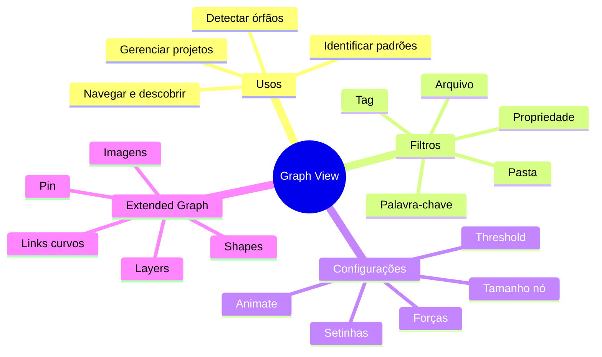

# Graph View do Obsidian — utilidade, configuração e customização

> [!abstract] TL;DR
> O Graph View transforma notas em um grafo navegável. Usos práticos: identificar padrões, descobrir conhecimento órfão, gerenciar projetos e navegar por conexões. O plugin Extended Graph adiciona camadas visuais (imagens, shapes, layers, pin) sobre o grafo nativo.

> [!info] Fonte
> - **Well Pires** — *Qual a utilidade do gráfico do Obsidian* (YouTube)
> - **Extended Graph** — discussão no r/ObsidianMD com documentação e exemplos

## O que é o Graph View (básico)

- Nós = anotações; arestas = conexões entre elas.
- Não é só decoração: serve para **entender a estrutura do conhecimento** sem navegar só por pastas.

### 4 usos práticos

1. **Identificar padrões** — ver tópicos/tags mais comuns e quais estão subutilizados.
2. **Navegação e descoberta** — filtrar por tags, pastas, palavras-chave ou propriedades.
3. **Gerenciar projetos** — escrita criativa, artigos, teses e RPG.
4. **Detectar conhecimento órfão** — notas sem conexões que podem estar esquecidas.

#### Arquivos não criados vs órfãos

- **Arquivo não criado**: link `[[ ]]` para nota que ainda não existe (fica com estilo mais claro).
- **Órfão**: nota existente mas sem conexões.

## Configurações do Graph View nativo

| Recurso | Para que serve | Quando usar |
|---------|---------------|-------------|
| Setinhas de direção | Mostrar quem aponta para quem | Vaults pequenos/médios |
| Text Label Threshold | Controlar quando o nome da nota aparece ao aproximar | Vaults grandes |
| Tamanho do nó | Aumentar visibilidade de notas específicas | Destaque intencional |
| Grossura da linha | Destacar força da conexão | Pouco recomendado para vaults grandes |
| Animate | Animação de crescimento | Apresentação/demos |

### Forças do grafo

- **Força central**: influencia o centro de atração do grafo.
- **Repulsão**: quanto maior, mais os nós se afastam.
- **Link force**: força de atração entre nós conectados.
- **Distância do link**: define quão perto ficam os nós ligados.

## Filtros e grupos

### Filtros úteis

- **Tag**: `tag:#ttrpg` → agrupa por tags
- **Pasta**: `path:periodico` → filtra anotações de diário
- **Arquivo**: `file:"abertura de processo"` → templates e documentos recorrentes
- **Palavra-chave na mesma linha**: busca textual dentro do bloco
- **Propriedade**: `autor:"fulano"` → usa propriedades do Obsidian
- **Órfãos**: notas sem conexões; útil para revisar conhecimento não linkado

### Grupos por cor

- Cores atribuídas por regras: `tag:#rpg` → laranja, `path:periodico` → azul
- Permitem ver clusters temáticos rapidamente
- Útil para ver dispersão ou centralização de temas

## Extended Graph (plugin)

O plugin **sobrepõe estilo e informação** sobre o grafo nativo, sem alterar o grafo estruturalmente.

| Recurso | O que faz |
|---------|-----------|
| Imagem/ícone | Renderiza imagem estática ou dinâmica no nó |
| Shapes | Forma geométrica diferente (estrela, diamante, círculo, quadrado) |
| Node size | Tamanho explícito do nó (`size: 400` = 4x padrão) |
| Links curvos | Arestas com curvatura para relações bidirecionais |
| Pin | Fixar nó em posição (hubs visuais parados) |
| Layers | Distribuir notas por profundidade/transparência |

- Também permite: alterar nome exibido no nó (sem renomear arquivo), truncar textos longos, mostrar só nome de anexos, usar CSS com seletores estendidos, filtrar tipos de links, mostrar labels nas arestas, ocultar relações por tipo.
- Integração com plugins auxiliares: **Iconic** ou **Iconize** para ícones.

### Configuração passo a passo do Extended Graph

1. Adicione propriedades relevantes no frontmatter das notas.
2. Acesse as configurações do Extended Graph e crie regras por condição sobre essas propriedades.
3. Use a UI do plugin para combinar tags + filtros de propriedade.
4. Para vaults grandes, ative o plugin só no **local graph** para preservar desempenho.

> [!warning] Case-sensitive
> Propriedades são case-sensitive: `Level` e `level` são distintas. Para evitar bugs, prefira valores do tipo **text**.

### Exemplos de regras comuns

- Shape = diamante quando property `Level` = 2
- Size = 400 quando property `size` = 400
- Layer = `1_departament` ou só `1`
- Imagem vinculada a campo em propriedades do nó

## Graph local

Atalho para abrir comandos:
- Windows: `Ctrl + P`
- Mac: `Cmd + P`
- Comando: `Graph: Open Graph View` ou `Graph: Open Local Graph`

O graph local foca apenas nas conexões da nota aberta, evitando sobrecarga visual.

## Casos de uso avançados

- **RPG e escrita criativa**: conectar personagens, locais e tramas.
- **Pesquisa acadêmica**: conectar teorias, autores e conceitos.
- **Clientes/consultoria**: agrupar documentos por tipo (`abertura de processo`).
- **Blog e conteúdo**: ver como temas de blog se conectam a outros assuntos.

## Aplicação no Segundo Cérebro

- Use regras visuais para diferenciar pilares do vault por **shape** ou **cor**.
- Fixe em **pin** nós centrais por projeto ou tema.
- Aplique **layers** por período, domínio ou importância.
- Prefira frontmatter limpo: 1 a 3 propriedades por nota já bastam para regras poderosas.
- Mantenha coerência entre propriedades usadas e regras criadas (nomes e tipos).
- Considere usar Extended Graph apenas no local graph em vaults grandes.

## 🗺️ Mapa

## 📌 Cola rápida

| Ação | Resultado |
|------|-----------|
| Habilitar tags no Graph View | Ver centros de informação por hashtag |
| Filtrar por pasta `path:periodico` | Focar em anotações diárias |
| Ativar órfãos | Identificar notas sem conexão |
| Abrir graph local | Explorar sem sobrecarga |
| Agrupar por tag/pasta | Ver clusters temáticos |
| Usar Extended Graph | Customizar shapes, imagens e layers sem quebrar o grafo |
