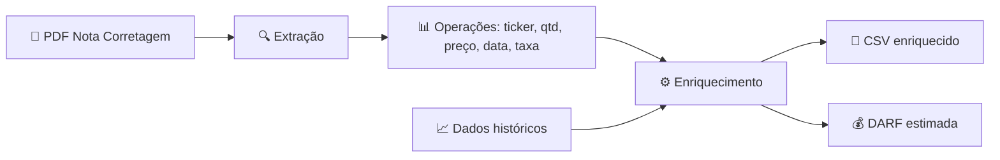

# 🔖 Pipeline Nota de Corretagem

> [!abstract] TL;DR
> <!-- tema:conhecimento -->
# Pipeline Nota de Corretagem

---
tags:
  - grupo/conhecimento
---
---

# Pipeline Nota de Corretagem

> Pipeline de extração e enriquecimento de notas de corretagem.

## Fluxo

1. **Entrada**: PDF da nota de corretagem (arquivo ou extração automática)
2. **Extração**: parser extrai operações (ticker, quantidade, preço, data, taxa)
3. **Enriquecimento**: cruza com dados históricos do ativo, calcula custo médio
4. **Relatório**: gera CSV enriquecido e DARF estimada

## Projetos relacionados
- [[02-projetos/skill-nota-corretagem.md]]
- [[02-projetos/controle-de-ativos.md]]

## Ligações
- [[03-conhecimento/skills/README.md]]
- [[03-conhecimento/mercado-financeiro/README.md]]
---

## 📌 Cola rápida

| Pilar | Em uma frase |
|---|---|
| **Tema** | Preencher |
| **Tese** | Preencher |
| **Ação** | Preencher |
