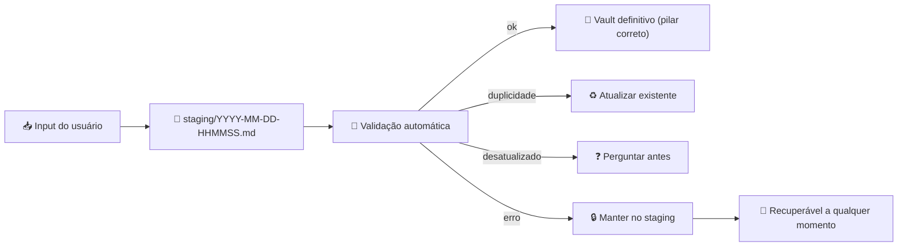
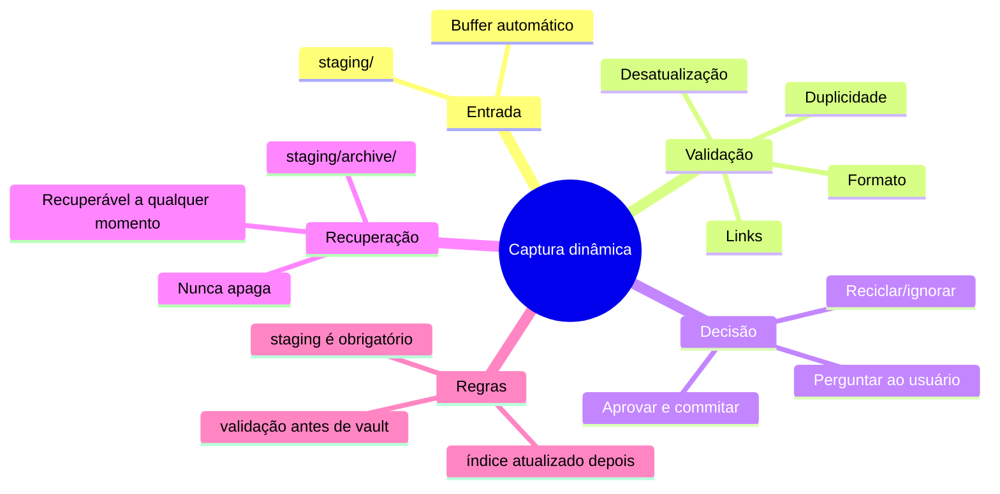

tags:
  - grupo/conhecimento

# 🔖 Captura dinâmica — sem perder informação importante

> [!abstract] TL;DR — capture primeiro, confira depois, não perca nada no caminho
> O Segundo Cérebro agora usa um **staging dinâmico** antes de salvar no vault definitivo. Nada é perdido: se a validação falhar, o conteúdo continua recuperável. O fluxo é: **buffer → validação → commit → índice**.

> [!info] Problema resolvido
> Antes: captura direta podia perder informações ou criar dispersão por falta de validação intermediária.  
> Agora: staging com validação automática em tempo real.

---

## 🧠 Mecanismo: staging antes do vault

O fluxo não vai mais direto para o vault. Ele passa por um **staging area** temporária:



> [!quote] Kennedy
> "Os salvamentos tem de ser mais dinâmicos para não se perder alguma informação importante."

---

## ⚙️ Fluxo dinâmico de captura

### 1. Buffer automático (staging)
Todo input novo vai primeiro para:
- `05-sistema/staging/YYYY-MM-DD-HHMMSS.md`
- Formato: **timestamp + conteúdo cru**
- Nunca é deletado automaticamente
- Se o sistema falhar, o staging continua lá

### 2. Validação imediata
Assim que o staging é criado, o sistema checa:

| Checagem | O que faz | Se falhar |
|---|---|---|
| **Duplicidade** | Busca no vault por tema/autor/conceito | Marca como possível duplicata |
| **Desatualização** | Compara data da nota com a do staging | Marca como possível desatualização |
| **Formato mínimo** | Frontmatter + estrutura válida | Corrige automaticamente |
| **Links quebrados** | Verifica wikilinks se existirem | Avisa e corrige |

### 3. Decisão dinâmica
- **Sem duplicidade/desatualização** → move para o pilar correto + atualiza `index.md`
- **Com duplicidade** → pergunta ao usuário: reusar, atualizar ou manter separado
- **Com desatualização** → pergunta se quer regenerar
- **Com erro de validação** → circula pelo staging até corrigir

### 4. Commit e índice
Só depois de aprovado:
- Arquivo vai para o pilar definitivo (`01-eu/`, `02-projetos/`, `03-conhecimento/`, `04-capturas/`, `05-sistema/`)
- `index.md` é atualizado
- Staging é arquivado (não deletado) em `05-sistema/staging/archive/`

### 5. Recuperação
- Qualquer arquivo no staging pode ser recuperado com: `recuperar staging/<arquivo>`
- O sistema nunca apaga conteúdo — só move para archive

---

## 📋 Formato do staging

Cada arquivo no staging tem:

```markdown
---
id: YYYY-MM-DD-HHMMSS
tipo: conhecimento/projeto/decisão/operacional
status: staging/aprovado/recuperado
checks:
  duplicidade: pendente/aprovado/reprovado
  desatualizacao: pendente/aprovado/reprovado
  formato: pendente/aprovado/reprovado
---

# Conteúdo cru do input
...
```

> [!tip] O staging é a fonte da verdade temporária
> Se o sistema travar ou o usuário fechar a sessão, o staging continua lá. Nenhuma informação é perdida — só falta a validação final.

---

## 🎯 Em que é útil

- **Captura mobile/voz rápida** — input cru não precisa estar perfeito para ser salvo
- **Fontes com conteúdo grande** — staging guarda tudo antes de processar
- **Captura em lote** — múltiplos inputs vão para o staging e são processados depois
- **Recuperação após falha** — nada se perde se o agente travar
- **Validação colaborativa** — o usuário pode aprovar/rejeitar antes de ir para o vault

---

## 🚀 Como usar

### Modo rápido (direto)
```
Captura dinâmica: [conteúdo]
```
→ Vai para staging, valida automaticamente, pergunta só se precisar.

### Modo curado (manual)
```
Captura dinâmica: [conteúdo]
tipo: projeto
área: 02-projetos
confiança: alta
```
→ Menos perguntas, pois você já deu os metadados.

### Modo buffer (só guardar para depois)
```
Buffer: [conteúdo cru]
```
→ Salva no staging sem validar. Você valida depois com `processar staging`.

### Recuperar
```
recuperar staging/2026-06-18-143022.md
```
→ Move de volta para análise.

---

## 📦 O que precisa para funcionar

| Item | Obrigatório? | Função |
|---|---|---|
| **Pasta staging** | Sim | `05-sistema/staging/` |
| **Validação automática** | Sim | Checagem de duplicidade/desatualização |
| **Formato de staging padronizado** | Sim | Garante recuperação |
| **Archive de staging** | Sim | Nunca deleta, só move |
| **Atualização de índice** | Sim | Só depois de aprovado |

> [!warning] Nunca salve direto no vault sem staging
> O fluxo obrigatório é: staging → validação → commit.  
> Exceto quando o usuário explicitamente pedir "salvar direto" — mas mesmo assim, o sistema cria um staging temporário como backup.

---

## 🔄 Checagem de duplicidade e desatualização (automática)

| O que | Como | Ação |
|---|---|---|
| Tema repetido | Busca por palavras-chave | Marca possível duplicata |
| Mesmo autor/fonte | Busca por título | Marca possível duplicata |
| Conceito igual, nome diferente | Busca por sinônimos | Marca possível duplicata |
| Data da fonte > 6 meses | Compara com data da nota | Marca possível desatualização |

---

## 🗺️ Mapa



---

## 📌 Cola rápida

| Pilar | Em uma frase |
|---|---|
| 🧠 **Tese** | Capture primeiro, confira depois, não perca nada |
| 🔁 **Mecanismo** | staging → validação → commit → índice |
| ⚙️ **Regra** | Nunca salve direto no vault sem buffer |
| 📦 **Requer** | pasta staging, validação automática, archive |
| 🎯 **Útil para** | captura mobile, fontes grandes, lote, recuperação |
| 🧭 **Filosofia** | informação importante nunca é perdida, só temporariamente não classificada |

## Projetos relacionados
- [[02-projetos/skill-hermes.md]] — Hermes executa este fluxo de captura dinâmica
- [[02-projetos/projetos-de-ia.md]] — guarda-chuva dos projetos de IA
