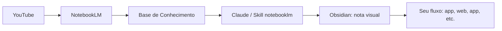
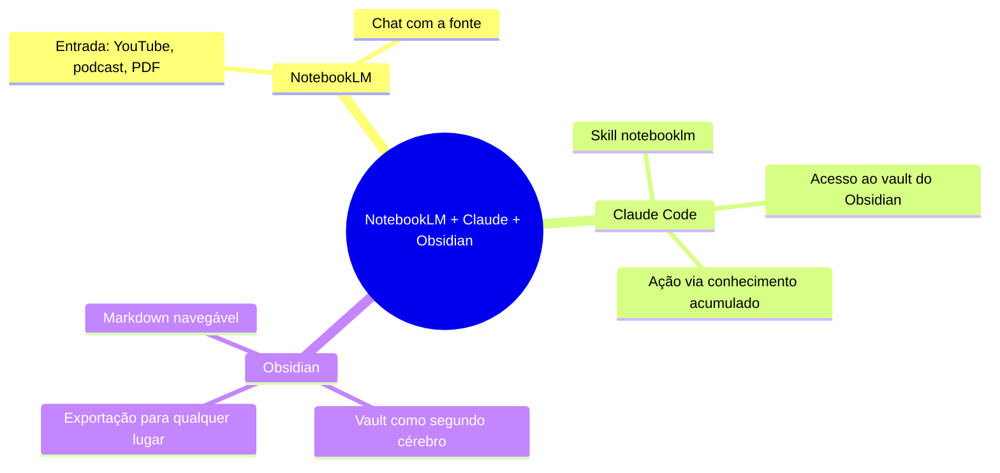

# 🔖 NotebookLM vai mudar pra sempre a maneira que você usa o Claude

> [!abstract] TL;DR
> Integre NotebookLM com Claude via Obsidian para criar uma memória acumulativa. O NotebookLM vira sua base de conhecimento; o Obsidian organiza e expõe ao modelo; o Claude executa com contexto real sem pedir memória toda hora.

> [!info] Fonte
> Canal: **Well Pires**  
> Tema: NotebookLM + Claude + Obsidian  
> Formato: vídeo + notebook

## Ideia central

O problema não é falta de modelo inteligente, é **amnésia do Claude**. Toda nova sessão apaga o contexto anterior. A solução apresentada não é lembrar o Claude manualmente, mas construir um ** Segundo Cérebro compartilhado** alimentado pelo NotebookLM.

- **NotebookLM**: recebe vídeos, podcasts e PDFs e gera base de conhecimento consultável.
- **Obsidian**: armazena esse conhecimento em Markdown navegável e linkável.
- **Claude + skill notebooklm**: acessa essa base sem precisar reenviar todo o contexto, usando o NotebookLM como memória externa estável.

### Por que esse fluxo?

| Dor | Solução |
|-----|---------|
| Claude esquece conversas anteriores | NotebookLM como memória acumulada |
| Obsidian fica isolado da IA | Skill notebooklm conecta Claude a notebooks |
| NotebookLM não exporta conhecimento | Claude transforma conteúdo em nota/ação |
| Curadoria manual é lenta | YouTube -> NotebookLM -> nota visual em um pipeline |

## Conceitos e fluxo

- **Regra-chave**: conhecimento não vale se não sai do NotebookLM.
- **Skill criada pelo autor**: sheight-to-notebook / notebook-to-md, que formata a saída em nota digerível para o Obsidian.
- **Custo**: NotebookLM Pro, ~R$9,90/mês nos três primeiros meses.

## Como aplicar

1. Instale **Obsidian** e crie um vault.
2. Dê acesso a esse vault ao **Claude Code**.
3. Instale a skill **notebooklm** no Claude Code.
4. Conecte sua conta Google no NotebookLM.
5. Para cada vídeo que quiser absorver:
   - Use a extensão **YouTube to NotebookLM**.
   - Crie o notebook e já vá fazendo perguntas quando precisar.
   - Passe esse notebook para o Obsidian via skill.

### Exemplo prático

- Canal: Leandro Twin  
- Vídeo: treino de peito em 30 minutos  
- Resultado: pasta fitness criada automaticamente no Obsidian + nota formatada contendo exercícios, volumes e série.

## Camada mais profunda

O autor defende que essa é a primeira vez que temos uma **biblioteca de Alexandria da IA pessoal**. O NotebookLM é o acervo; o Claude é o agente; o Obsidian é o repositório linkado. A base do valor não está no modelo sozinho, está na **ponte entre ferramentas** — e na skill que padroniza a saída final.

Atenção: não basta salvar PDF ou link no NotebookLM. Tem que haver um fluxo que **exporte** esse conhecimento. Do contrário, fica preso no Google.

## 🗺️ Mapa

## 📌 Cola rápida

| Etapa | Ação | Resultado |
|------|------|-----------|
| 1 | Adicionar vídeo ao NotebookLM | Base de conhecimento pronta |
| 2 | Instalar skill notebooklm no Claude | Integração nativa |
| 3 | Ligar Obsidian ao Claude Code | Leitura/escrita no vault |
| 4 | Converter notebook -> nota visual | Material digerível |
| 5 | Automatizar em comunidade/skill | Reuso contínuo |
