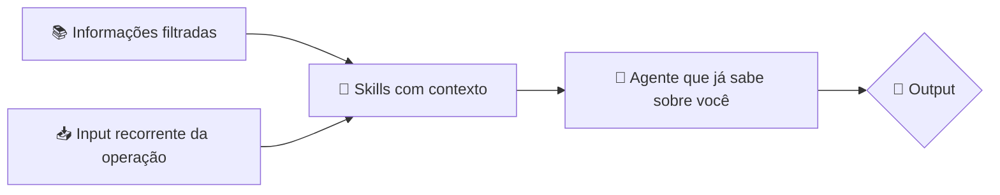
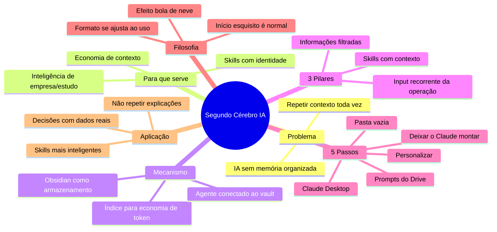

tags:
  - grupo/conhecimento

# 🔖 Segundo Cérebro com Obsidian e Claude — versão completa

> [!abstract] TL;DR — pare de repetir contexto para a IA
> Você acumula conhecimento fragmentado e **gasta tempo explicando a mesma coisa toda vez para o agente/IA**. O segundo cérebro resolve isso armazenando tudo no Obsidian, indexando para consulta barata e conectando com **um agente e skills que passam a ter contexto real sobre você**.
>
> **É ganhar tempo agora para perder muito menos depois. E não é só para "quem usa IA": é para quem quer que a IA pare de ser genérica e passe a ser *sua*.**

> [!info] Origem
> **Fonte:** vídeo *"Como Construir seu SEGUNDO CÉREBRO de IA (Claude Code + Obsidian)"*  
> **NotebookLM:** notebook `0fJ0WvU-TGk`, criado em 2026-06-18  
> **Conteúdo bruto:** 19.782 caracteres (fonte única: YouTube)

---

## 🧠 Todo o conteúdo da fonte, organizado

> [!abstract] Resumo dinâmico da fonte
> O vídeo ensina, passo a passo, a montar um **segundo cérebro funcional** no Obsidian, usando Claude Desktop como agente e skills para transformar informação em resultados. O autor argumenta que a maior parte das pessoas constrói o vault, mas **não sabe o que fazer com as informações lá dentro**.

### O que o autor diz (texto integral destilado, sem inventar)

#### Problema central
- Pessoal usa IA todo dia.
- Toda vez que começa um chat novo, tem que explicar **tudo de novo**.
- Skills são genéricas porque não tem contexto de quem você é, do seu negócio, dos seus projetos.
- Segundo cérebro vira modinha: "ah, tô usando Obsidian" — mas o ouro não é anotar. **É usar as anotações**.

#### 3 usos principais do segundo cérebro (pelo autor)
1. **Economia de contexto com IA** — parar de explicar a mesma coisa para o agente.
2. **Skills mais inteligentes** — a skill passa a funcionar com a SUA realidade (seus funis, seus clientes, seus erros e acertos).
3. **Inteligência de empresa/operador** — documentos, relatórios, testes, metas, gargalos ficam organizados e consultáveis.

#### Público-alvo citado
- COP (gestor de tráfego)
- Dono de operação
- Estudante
- Qualquer pessoa que use IA no dia a dia

#### O que o autor NÃO cobre no vídeo
- O prompt do Drive (é um recurso externo).
- Configurações avançadas do Obsidian além do básico.
- Detalhes técnicos da skill de resenha (só menciona que existe).

---

## ⚙️ Para que serve

| Situação | Sem segundo cérebro | Com segundo cérebro |
|---|---|---|
| Novo chat com IA | Explicar tudo de novo | Ela já sabe sobre você |
| Skills | Genéricas, repetitivas | Aprendem seu jeito com o tempo |
| Decisões | Baseadas em memória falha | Baseadas em dados organizados |
| Estudos/projetos | Fragmentados, esquecidos | Indexados, consultáveis em segundos |

**Não é uma ferramenta. É uma camada de contexto persistente entre você e a IA.**

---

## 🚀 Como usar (passo a passo)

| Passo | Ação | Detalhe |
|---|---|---|
| **1** | Criar pasta vazia no computador | Vai ser o vault do Obsidian |
| **2** | Instalar e abrir o Claude Desktop | Escolher a pasta criada como workspace |
| **3** | Pegar os dois prompts do Drive | Um para o cérebro, um para o agente |
| **4** | Personalizar os prompts | Nome, sua profissão, seus projetos, tom de voz |
| **5** | Colar no Claude e responder suas perguntas | Ele monta a estrutura alfa do vault |

### Ciclo normal depois do alfa
1. Jogar conteúdo novo no chat (artigo, vídeo, anotações)
2. O Claude organiza no vault automaticamente
3. Ajustar o formato com o tempo — ninguém acerta na primeira
4. Skills vão ficando cada vez mais **sua cara**

> [!warning] Dependência externa
> Este método depende de **dois prompts hospedados no Google Drive** (link no comentário fixado do vídeo). Eles não estão nesta nota — acesse o vídeo para pegar o documento.

---

## 📦 O que precisa para funcionar

| Item | Obrigatório? | O que faz |
|---|---|---|
| **Obsidian** | Sim | Armazenamento local das notas |
| **Claude Desktop** | Sim | Agente que edita e organiza o vault |
| **Prompts do Drive** | Sim | O "coração" da estrutura alfa |
| **Skills** | Não, mas recomendado | Transformam contexto em output formatado |
| **NotebookLM** | Não obrigatório, mas útil | Para digerir vídeos/áudios antes de enviar ao Claude |

> [!tip] Skills como multiplicador
> Skills que você já usa (`notebook-to-md`, `nota-de-corretagem`, etc.) viram **muito mais poderosas** quando elas leem o vault. O segundo cérebro é o combustível; as skills são o motor.

---

## 🎯 Em que é útil

- **Para quem usa IA todo dia** — elimina 97% do trabalho de contexto repetido.
- **Para gestor de tráfego** — documentar testes (BID, escala baiana, etc.) e ter dados prontos para análise da IA.
- **Para dono de operação** — armazenar relatórios, métricas, gargalos, acertos e tomar decisões com dados reais.
- **Para estudante** — mapear em qual estágio você está de uma matéria ou idioma e estudar com direção.
- **Para quem faz conteúdo/COP** — swipe de criativos bons, análise de VSLs, anotações de livros/podcasts.
- **Para equipes** — toda a inteligência da empresa (metas, performance, processos) pode viver ali.

> [!quote] Autor
> "Se você é dono de operação, esse segundo cérebro te ajuda a armazenar dados, metas, performance de colaborador, gargalos, acertos — toda a inteligência da tua empresa."

---

## 🔄 Checagem de duplicidade e desatualização

| O que foi verificado | Resultado |
|---|---|
| Notas existentes no vault com o mesmo tema | `segundo-cerebro-obsidian-claude.md` já existe em `03-conhecimento/programacao-e-ia/` |
| Conteúdo duplicado | Não — esta nota cobre o conteúdo de forma **mais completa** (todo o conteúdo + para que serve + como usar + checklist) |
| Data da fonte | 2026-06-18 |
| Esta nota reflete | O estado do vídeo/data atual; se o autor atualizar o método ou se os prompts do Drive mudarem, esta nota precisa de revisão |

> [!info] Decisão de duplicidade
> Mantive **as duas notas** porque:
> - `segundo-cerebro-obsidian-claude.md` é a versão anterior, mais enxuta.
> - **esta** é a versão completa e dinâmica, com todo o conteúdo da fonte, explicação de uso, pré-requisitos e checagem.
>
> Se quiser consolidar em um único arquivo, me avise e eu unifico.

---

## ⚙️ Os 3 pilares que fazem ele rodar

São **três** coisas que você alimenta de forma recorrente. Pular qualquer uma delas deixa o sistema pela metade.

### 📚 1. Informações filtradas
Swipe de criativos bons, anotações de livros, cursos, podcasts, artigos estratégicos, estudos. Tudo que é **relevante** e **reutilizável**.

### 🧩 2. Skills dentro do vault
As skills do agente viram muito mais poderosas quando leem o vault. Em vez de genéricas, funcionam com **a sua** realidade.

### 📥 3. Input recorrente da operação
Relatórios de call center, taxa de conversão, etapa do estudo, performance de colaborador. **É recorrente, não pontual.**

> [!tip] A regra dos três
> Se algum dos três parar, o sistema esfria. Informação parada = skills desatualizadas = agente repetindo o que você já explicou.

---

## 🏗️ Filosofia: a estrutura é só o começo

> [!abstract] Substância > forma
> O formato de organização do vídeo (funil de vendas, tráfego, copy, gestão) é o que funciona para o autor. **Não obriga você a usar a mesma estrutura.** O prompt inicial gera uma versão alfa. Você ajusta — pois vai usar.

> [!quote] Autor
> "No início você vai perder tempo. As skills vão performar de maneira esquisita. Mas com o tempo, qualquer conteúdo que você colocar vai ficar cada vez mais com a sua cara."

---

## 🎯 Como aplicar

- Use como **fonte primária** para montar o **seu** segundo cérebro do zero.
- O ciclo saudável é: **input → organização → consulta → output melhor**.
- Skills que você já usa (`notebook-to-md`, `nota-de-corretagem`, etc.) viram muito mais poderosas quando tem contexto real no vault.
- A regra dos **3 pilares** (informações filtradas, skills, input recorrente) vale para qualquer formato de segundo cérebro — não só o deste vídeo.
- Personalize o tom, a estrutura e as skills **para o seu uso** — ninguém acerta na primeira.

---

## 🗺️ Mapa

---

## 📌 Cola rápida

| Pilar | Em uma frase |
|---|---|
| 🧠 **Tese** | Parou de repetir contexto para a IA |
| 🔁 **Mecanismo** | Obsidian indexado + agente conectado = memória viva |
| ⚙️ **Pilares** | Informações filtradas, skills, input recorrente |
| 🚀 **Passos** | Pasta → Claude Desktop → prompts → personalizar → montar |
| 📦 **Requer** | Obsidian + Claude Desktop + prompts do Drive |
| 🎯 **Útil para** | Operadores, gestores, estudantes, COP, donos de negócio |
| 🧭 **Filosofia** | A estrutura serve a você, não o contrário |
| 🔄 **Ciclo** | input → organização → consulta → output melhor |
