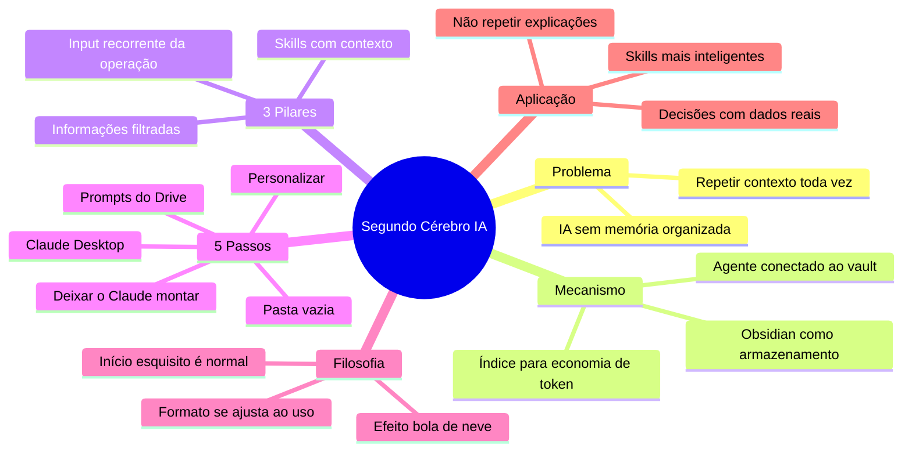

tags:
  - grupo/conhecimento

# 🔖 Segundo Cérebro com Obsidian e Claude

> [!abstract] TL;DR — parar de repetir contexto para a IA
> Você acumula conhecimento fragmentado e **gasta tempo explicando a mesma coisa toda vez para a IA**. O segundo cérebro resolve isso armazenando tudo no Obsidian, indexando para consulta barata e conectando com um agente/skills que passam a ter contexto real sobre você.
>
> **É ganhar tempo agora para perder muito menos depois.**

> [!info] Origem
> Vídeo: *Como Construir seu SEGUNDO CÉREBRO de IA (Claude Code + Obsidian)*  
> NotebookLM notebook criado em 2026-06-18 (vídeo `0fJ0WvU-TGk`).

---

## 🧠 O mecanismo: contexto repetido × persistência

O problema não é usar IA — é usar IA **sem memória organizada**.

| | 🌀 Sem segundo cérebro | 🧠 Com segundo cérebro |
|---|---|---|
| **Contexto** | Repetido a cada chat novo | Já indexado no vault |
| **Skills** | Genéricas, sem identidade | Aprendem seu jeito com o tempo |
| **Resultado** | Re trabalho toda vez | Efeito bola de neve |
| **Tempo** | Gasta-se todo explicando | Gasta-se uma vez guardando |

```mermaid
flowchart LR
    Info[\"📥 Nova informação\"] --> Index[\"📑 Índice atualizado\"] --> Agent[\"🤖 Agente + Skills\"] --> Result{\"🎯 Resultado\"}
    Repete[\"🔄 Repetir contexto toda vez\"] -.->|\"solução fraca\"| Result
```

> [!quote] Autor
> "Toda vez que você começa um chat novo, tem que explicar tudo de novo. O segundo cérebro pula 97% dessa etapa."

---

## ⚙️ Os 3 pilares que fazem ele rodar (não 2, não 4 — 3)

São **três** coisas que você alimenta de forma recorrente. Pular qualquer uma delas deixa o sistema pela metade.

```mermaid
flowchart LR
    A[\"📚 Informações filtradas\"] --> S[\"🧩 Skills com contexto\"]
    I[\"📥 Input recorrente da operação\"] --> S
    S --> R[\"🤖 Agente que já sabe sobre você\"] --> O{\"🎯 Output\"}
```

### 📚 1. Informações filtradas
São os insumos já processados: swipe de criativos bons, anotações de livros, cursos, podcasts, artigos estratégicos, estudos. Tudo que é **relevante** e **reutilizável**.

### 🧩 2. Skills dentro do vault
As skills do agente viram muito mais poderosas quando elas leem o vault. Em vez de serem genéricas, elas passam a funcionar com **a sua** realidade — seus funis, seus clientes, seus acertos e erros.

### 📥 3. Input recorrente da operação
Dados que mudam toda semana: relatórios de call center, taxa de conversão, etapa do estudo de russo, performance de colaborador. Não é "um dia sim, outro também". É **recorrente**.

> [!tip] A regra dos três
> Se algum dos três parar, o sistema esfria. Informação parada = skills desatualizadas = agente repetindo o que você já explicou.

---

## 🚀 Os 5 passos para montar

O fluxo de construção em si tem uma sequência — não adianta pular.

| Passo | Ação | O que acontece |
|---:|---|---|
| 1 | Criar pasta vazia no computador | Vai ser o vault do Obsidian |
| 2 | Instalar e abrir o Claude Desktop | Escolher a pasta criada como workspace |
| 3 | Pegar os dois prompts do Drive | Um para o cérebro, um para o agente |
| 4 | Personalizar os prompts | Nome, o que você faz, seus projetos, tom de voz |
| 5 | Colar no Claude e responder suas perguntas | Ele monta a estrutura alfa do vault |

> [!warning] Passo 3 depende de recurso externo
> Os prompts estão num link do Drive no comentário fixado do vídeo. Não faz parte desta nota — você precisa acessar o vídeo para pegar o documento.

> [!example] O que o Claude monta automaticamente
> - **Do sistema:** comandos, regras de comportamento
> - **Do agente:** nome, tom, diretrizes
> - **Do índice:** sumário vivo de onde cada informação está (economiza token)
> - **Da memória:** resumo da sessão para ele lembrar o que foi conversado ontem

E depois do alfa, o ciclo normal:

1. Jogar conteúdo novo no chat do Claude (artigo, vídeo, anotações)
2. Ele organiza no vault automaticamente
3. Ajustar o formato com o tempo — ninguém acerta na primeira
4. Skills vão ficando cada vez mais **sua cara**

---

## 🏗️ Filosofia: a estrutura é só o começo

> [!abstract] Substância > forma
> O formato de organização deste vídeo (funil de vendas, tráfego, copy, gestão) é o que funciona para o autor. **Não obriga você a usar a mesma estrutura.** O prompt inicial gera uma versão alfa. Você ajusta — pois vai usar.

```mermaid
flowchart LR
    Prompt[\"📝 Prompt inicial\"] --> Alfa[\"🔧 Versão alfa do vault\"] --> Uso[\"🔁 Uso real + ajustes\"] --> Maduro[\"🧠 Segundo cérebro maduro\"]
    Uso -.->|\"o que não funcionou\"| Alfa
```

> [!quote] Autor
> "No início você vai perder tempo. As skills vão performar de maneira esquisita. Mas com o tempo, qualquer conteúdo que você colocar vai ficar cada vez mais com a sua cara."

---

## 🎯 Como aplicar

- Use como **fonte primária** para montar o seu segundo cérebro do zero
- O ciclo saudável é: input → organização → consulta → output melhor
- Skills que você já usa (ex.: `notebook-to-md`, `nota-de-corretagem`) viram muito mais poderosas quando tem contexto real no vault
- O efeito bola de neve é real: quanto mais informação boa entra, melhor cada resultado do agente fica
- A regra dos **3 pilares** (informações filtradas, skills, input recorrente) vale para qualquer formato de segundo cérebro — não só o deste vídeo

---

## 🗺️ Mapa



---

## 📌 Cola rápida

| Pilar | Em uma frase |
|---|---|
| 🧠 **Tese** | Parou de repetir contexto para a IA |
| 🔁 **Mecanismo** | Obsidian indexado + agente conectado = memória viva |
| ⚙️ **Pilares** | Informações filtradas, skills, input recorrente |
| 🚀 **Passos** | Pasta → Claude Desktop → prompts → personalizar → montar |
| 🧭 **Filosofia** | A estrutura serve a você, não o contrário |
| 🎯 **Resultado** | skills mais inteligentes + tempo economizado |
