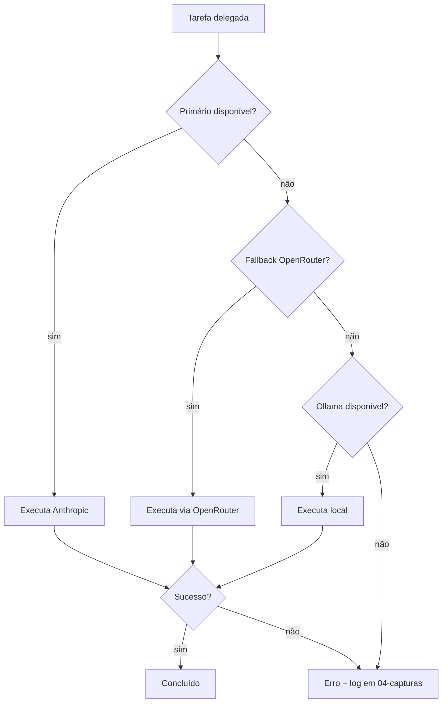

# ⚠️ Limites e fallback de provedores de IA no Hermes

> [!abstract] TL;DR
> Cada provedor tem limite diferente. Quando acabar, o `delegate_task` falha.
> Resolver com **Ordem de preferência**, **OpenRouter como fallback** e **Ollama para offline**.

> [!info] Fonte
> Documentação oficial de cada provedor + experiência com `delegate_task`.

---

## 📊 Tabela de limites comuns

| Provedor | Limite típico | Custo | Fallback recomendado |
|---|---|---|---|
| **OpenAI GPT** | RPM + TPM por chave | Pago | `openrouter` → `anthropic` → `codex local` |
| **Anthropic Claude** | RPM por tier | Pago | `openrouter` → `google` → `claude-code` |
| **Google Gemini** | RPM gratuito / taxa paga | Freemium | `openrouter` → `anthropic` → Gemini 2.0 Flash |
| **xAI Grok** | RPM por plano | Pago/Freemium | `openrouter` → `google` → `anthropic` |
| **OpenRouter** | Crédito / modelo | Pago por uso | `ollama` (offline) |
| **Ollama / LM Studio** | VRAM + CPU | Gratis/local | N/A (é o último degrau) |

> [!tip] Ordem de preferência para setup Kennedy
> Primário: **`anthropic`** (Claude via API).
> Secundário: **`openrouter`** (rota automática).
> Terciário: **`ollama`** (offline, sem envio para nuvem).
> Específicos: **`codex`**, **`claude-code`**, **`opencode`** por ferramenta.

---

## 🧠 Filosofia de fallback

```
Primário (provedor preferido)
    ↓ falha / limite
Secundário (OpenRouter)
    ↓ falha / limite
Terciário (modelo local Ollama)
    ↓ falha / limite
Desiste e reporta erro claramente
```

> [!warning] Nunca delegar cegamente após falha
> Sempre diagnosticar: erro de quota, modelo indisponível, ou prompt bloqueado.

---

## 🔧 Configurando fallback no Hermes

### 1. Ajustar `model_provider` no config

- `primary` = provedor padrão
- `fallback` = rota alternativa automática (OpenRouter ou outro)
- Camada local sempre disponível se Ollama estiver instalado

### 2. Em `delegate_task`

- Passar `model` e `provider` explícitos quando quiser forçar um agente.
- Deixar `provider` oculto para usar o padrão + fallback automático.

### 3. Código de exemplo

```python
# Exemplo conceitual de delegação com fallback

# Tenta Anthropic primeiro
delegate_task(
    goal="...",
    toolsets=["terminal", "file"],
    model="claude-3.5-sonnet",
    provider="anthropic"
)

# Se falhar, cai para OpenRouter
delegate_task(
    goal="mesma tarefa",
    toolsets=["terminal", "file"],
    model="claude-3.5-sonnet",
    provider="openrouter"
)

# Último recurso: local
delegate_task(
    goal="mesma tarefa (versão reduzida)",
    toolsets=["terminal", "file"],
    model="llama3",
    provider="ollama"
)
```

---

## ✅ Checklist de resiliência

- [ ] **Quota monitorada:** saber quanto resta de RPM/TPM por provedor.
- [ ] **Chaves separadas:** não usar a mesma chave para tudo.
- [ ] **OpenRouter ativo:** ter crédito e modelo preferido configurado.
- [ ] **Ollama instalado:** pelo menos um modelo leve (Llama 3, Mistral) para emergências.
- [ ] **Logs de falha:** registrar em `04-capturas/` quando um provedor cair.
- [ ] **Prompt de contingência:** ter prompts reduzidos para modelos locais menores.

---

## 🧩 Mermaid — fluxo de resiliência



---

## 📌 Cola rápida

| Situação | Ação |
|---|---|
| Anthropic fora | Forçar `provider="openrouter"` |
| OpenRouter sem crédito | Forçar `provider="ollama"` |
| Ollama sem VRAM | Reduzir prompt / trocar por modelo menor |
| NotebookLM cheio | Pular NotebookLM, usar provedor direto |
| Claude Code CLI indisponível | Usar `anthropic` API |
| Codex CLI indisponível | Usar `openrouter` com modelo GPT |

---

## ❌ O que não fazer

- Não delegar em loop infinito trocando de provedor.
- Não silenciar erro de quota: registrar em `04-capturas/`.
- Não confundir limite de modelo com limite de Hermes.
- Não usar modelo local para tarefas que exigem cognição alta sem avisar.

---

> [!quote] Kennedy
> "Quando a nuvem falhar, o local assume. Quando o local falhar, o log assume."
