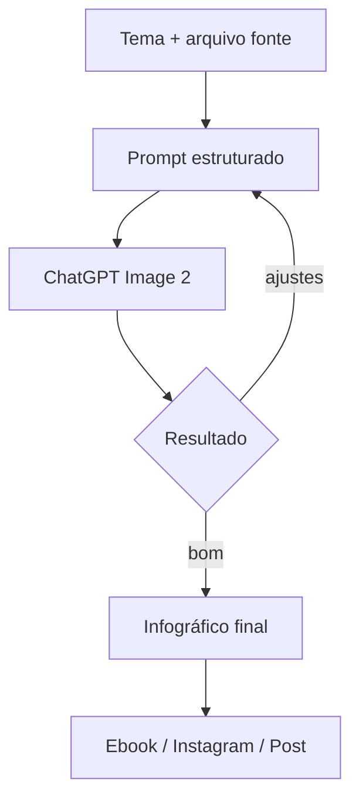
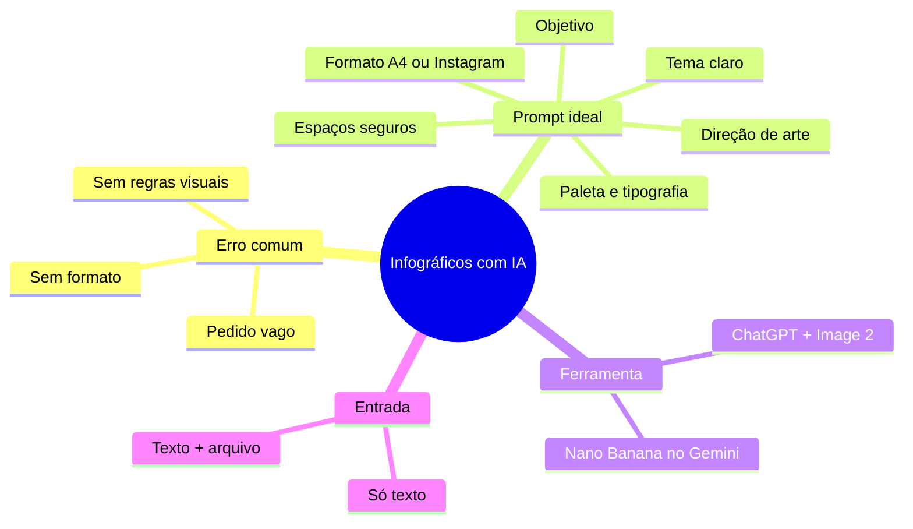

# 🔑 Aprenda como criar infográficos profissionais com inteligência artificial usando apenas 1 prompt

> [!abstract] TL;DR
> O erro não é a IA: é o prompt. Em vez de pedir "crie um infográfico sobre X", use um **comando estruturado** com objetivo, formato, regras visuais e espaço seguro. Com isso, ChatGPT + DALL-E geram infográficos prontos para ebook ou Instagram.
>
> **Resultado:** sem erros de português, com margem, hierarquia visual e imagem central.

> [!info] Fonte
> **Título:** Aprenda como criar infográficos profissionais com inteligência artificial usando apenas 1 prompt
> **Canal:** Roberto Paes
> **Duração:** 12:53
> **Data:** 2026-06-12
> **URL:** https://www.youtube.com/watch?v=551vtXQksRE

---

## 🧠 O maior erro na criação de infográficos com IA

> [!warning] O que todo mundo faz
> "Crie um infográfico sobre o tema X"
>
> A IA recebe quase nada, ocupa todo o espaço da imagem e entrega algo genérico, sem regra visual, sem espaçamento e com erros de texto.

> [!tip] O que muda o resultado
> O prompt não é só "o tema". É um **comando estruturado** que define:
> - objetivo do infográfico
> - formato (A4 / Instagram)
> - estrutura visual e tratamento
> - área de imagem central
> - palette de cores e tipografia
> - espaços seguros para texto

---

## 🛠️ Ferramenta utilizada

> [!example] ChatGPT + DALL-E / Image 2
> O vídeo usa o **ChatGPT** porque o **Image 2** dá resultado mais consistente que alternativas como **Nano Banana** no Gemini.
>
> O autor já testou ambos e ficou com o ChatGPT para essa tarefa.

---

## 📐 Prompt estruturado para infográfico profissional

> [!success] Estrutura do prompt
> 1. **Tema** do infográfico.
>
> 2. **Formato**: A4 para ebook ou Instagram.
>
> 3. **Objetivo principal**: converter, explicar, apresentar, etc.
>
> 4. **Direção de arte**: linhas de margem, estrutura visual, tratamento inteligente.
>
> 5. **Regras de composição**:
>    - respeitar espaçamentos
>    - não poluir áreas de texto
>    - manter ícones e números em zonas seguras
>    - definir palette e tipografia
>    - imagem central com ~40% da composição

> [!tip] Arquivo como entrada
> Além do tema, dá para **subir um arquivo** (PowerPoint, PDF) para a IA extrair pontos automaticamente. O autor demonstrou isso com uma apresentação sobre "IA: o futuro agora" e o resultado foi um infográfico de Instagram coerente com o material original.

---

## 🖼️ Do prompt ao arquivo final

> [!example] Fluxo rápido no ChatGPT
> 1. Copiar o prompt estruturado.
> 2. Ajustar tema, formato e detalhes visuais.
> 3. Colar no ChatGPT e selecionar **Image 2 / criar imagem**.
> 4. Baixar e usar no ebook, post ou apresentação.

> [!info] Resultado demonstrado no vídeo
> - Infográfico sobre **Revolução Industrial** em A4.
> - Infográfico sobre **Inteligência Artificial** para Instagram.
> - Textos legíveis, sem erros de português, com hierarquia e espaçamento profissional.

---

## 🚀 Dicas extras do vídeo

| O que fazer | Por que |
|---|---|
| Usar prompt ultra detalhado | Evita resultados genéricos |
| Especificar formato antes | Define proporção e layout |
| Pedir respeito a margens | Evita texto colado nas bordas |
| Subir arquivo fonte | A IA extrai pontos principais |
| Testar e comparar ferramentas | ChatGPT Image 2 vs Gemini Nano Banana |

---

## 🧩 Mermaid — fluxo da criação

---

## 🗺️ Mapa do conhecimento

---

## 📌 Cola rápida

| Problema | Solução direta |
|---|---|
| Infográfico amador | Troque prompt vago por prompt estruturado |
| Texto com erro | Deixe a IA gerar conteúdo limpo revisando pontos-chave |
| Layout desorganizado | Peça margens, espaçamentos e zonas seguras |
| Falta de padrão visual | Defina paleta, tipografia e imagem central no prompt |
| Preciso gerar variações | Ajuste formato e tema no mesmo comando base |

---

> [!quote] Roberto Paes
> "Deixe de simplesmente pedir 'crie um infográfico' e passe a ensinar a IA o que você quer, com regras, formato e objetivo."
