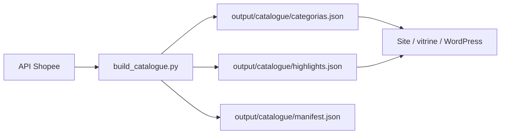
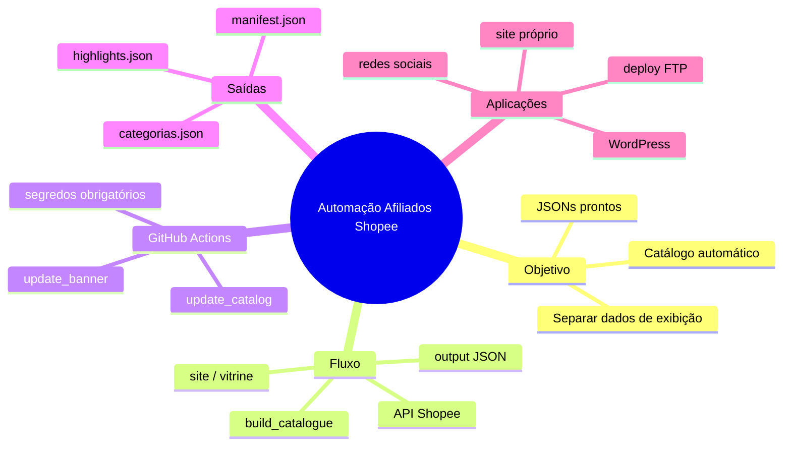

# 🔑 Automação para Afiliados com Python + GitHub Actions

> [!abstract] TL;DR
> O vídeo entrega um pacote Python completo para gerar, organizar e publicar automaticamente um catálogo de produtos de afiliados Shopee usando GitHub Actions, com saída em JSON pronta para alimentar qualquer site.
>
> **Fluxo final:** API Shopee → scripts Python → arquivos JSON → site/hospedagem.

> [!info] Fonte
> **Título:** Automação para Afiliados com Python + GitHub Actions
> **Canal:** Café com Dados & Gatos
> **Duração:** 21:15
> **Data:** 2026-06-15
> **URL:** https://www.youtube.com/watch?v=px7O23SvIn8

---

## 🧠 O que o projeto faz

> [!tip] Destaque central
> A automação separa a **coleta de dados** da **exibição**. Ela consome a API da Shopee, organiza os produtos por categoria, gera destaques e entrega arquivos JSON prontos para serem consumidos por um site independente.

### Fluxo geral

## 📁 Estrutura do projeto

> [!warning] Observação sobre execução
> Os arquivos em `output/` são gerados pela automação. Se quiser ver o resultado antes de rodar, use o repositório público com os JSONs já prontos.

| Pasta / arquivo | Função |
|---|---|
| `scripts/build_catalogue.py` | Coração do projeto: busca dados na API, organiza produtos e gera JSONs finais em `output/catalogue/` |
| `scripts/build_banners.py` | Gera banners/destaques visuais para usar na página inicial ou vitrine |
| `scripts/deploy_catalogue.py` | Opcional: publica automaticamente os arquivos gerados via FTP |
| `lib/shopee_client.py` | Cliente HTTP para comunicação com a API da Shopee |
| `lib/product_feed.py` | Transforma dados brutos da API em estrutura útil para catálogo |
| `lib/quality.py` | Critérios de pontuação para definir produtos em destaque |
| `lib/storage.py` | Grava os arquivos JSON finais em disco |
| `lib/logger.py` | Logs de execução para acompanhamento |
| `config/catalogue_config.py` | Ajustes do projeto: limite de produtos por categoria, destaques, modo de promoção etc. |
| `.github/workflows/update_catalog.yml` | Roda o catálogo terça e sexta, 06:00 UTC (`37 2 * * 2,5`) |
| `.github/workflows/update_banner.yml` | Roda os banners terça e sexta, 07:30 UTC (`37 7 * * 2,5`) |
| `requirements.txt` | Dependências Python instaladas automaticamente no GitHub Actions |
| `README.md` | Documentação do projeto: setup, execução local e modo de uso |

## ⚙️ GitHub Actions na prática

> [!example] Agendamento no workflow
> - `update_catalog.yml`: terça e sexta às **06:00 UTC**
> - `update_banner.yml`: terça e sexta às **07:30 UTC**
>
> Sequência deliberada: o banner roda depois do catálogo para usar dados mais recentes.
>
> Para alterar dias/horários basta editar o cron dentro de cada workflow. Documentação do fluxo no próprio README.

> [!danger] Segredos necessários
> No GitHub Actions (Settings → Secrets and variables → Actions) são obrigatórios:
> - `SHOPEE_APP_ID`
> - `SHOPEE_SECRET`
> - `FTP_HOST`
> - `FTP_USERNAME`
> - `FTP_PASSWORD`
> - `FTP_REMOTE_DIR`
>
> Se não quiser deploy automático, basta preencher só os dados da Shopee e rodar local.

## 📦 Entregas do pacote

> [!tip] Para quem só quer navegar/explorar
> Baixe o repositório e entre em `output/catalogue/`. Os JSONs ali já representam um estado válido de execução.

| Arquivo | Conteúdo |
|---|---|
| `categorias.json` | Produtos organizados por categoria |
| `highlights.json` | Best sellers e maiores descontos |
| `manifest.json` | Resumo da execução: data, quantidade de produtos, categorias etc. |

> [!quote] Denise (Café com Dados & Gatos)
> \"A ideia é separar a geração dos dados da exibição. Você pega os arquivos JSON e alimenta o site que quiser — WordPress, página própria ou vitrine.\"

## 🎯 Como aplicar

> [!success] Aplicações práticas
> - **Site de ofertas:** consuma os JSONs e monte uma vitrine com categorias, destaques e promoções.
> - **Redes sociais:** execute localmente, filtre produtos de interesse e gere conteúdo para posts/reels.
> - **Servidor próprio:** preencha os segredos FTP e deixe o deploy automático atualizar a hospedagem.
> - **WordPress / CMS:** basta ler os JSONs gerados e transformar em posts/pages programaticamente.
> - **Testes e prototipação:** rode `build_catalogue.py` localmente para validar categorias e produtos antes de automatizar.

## 🗺️ Mapa do conhecimento

## 📌 Cola rápida

| Pilar | Em uma frase |
|---|---|
| 🎯 **Tese** | Automatize o catálogo de afiliados com Python + GitHub Actions e receba JSONs prontos |
| ⚙️ **Mecanismo** | API Shopee → scripts Python → JSONs → site independente |
| 🚀 **Agendamento** | Terça e sexta automático via cron no GitHub Actions |
| 🔐 **Pegadinha** | Preencha os secrets da Shopee e, se usar deploy, os dados de FTP |
| 🛠️ **Extensão** | Qualquer site/fertinal que consuma JSON pode usar a saída |
'''
