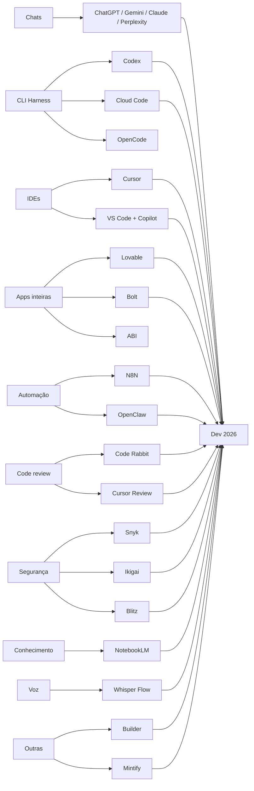
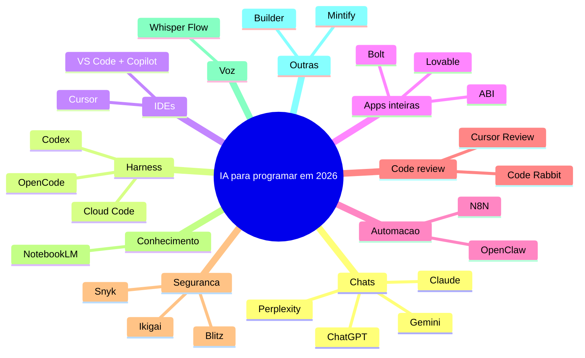

# 🔑 Como eu uso IA pra programar em 2026

> [!abstract] TL;DR
> Overview prático das ferramentas de IA que um dev pode usar hoje, separadas por categoria: chats, CLI/harness, IDEs, apps inteiras, automação, code review, segurança e conhecimento.
>
> **Recomendação direta:** Codex + Code Rabbit como base. O resto é contexto para você escolher conforme o caso.

> [!info] Fonte
> **Título:** Como eu uso IA pra programar em 2026
> **Canal:** Augusto Galego
> **Duração:** 20:14
> **Data:** 2026-05-27
> **URL:** https://www.youtube.com/watch?v=7nN4ayK79oc

---

## 🧠 Estado do mercado em 2026

> [!tip] Leitura central
> Não existe "melhor ferramenta" universal. O jogo é **escolher a ferramenta certa para o tipo de tarefa** e usar boas práticas de prompt. O vídeo é um overview, não um checklist obrigatório.

### Categorias do ecossistema

---

## ⚙️ Regras de ouro antes de usar qualquer ferramenta

> [!warning] Sem isso, a ferramenta não milagra
> - **Seja específico:** prompt curto e vago = resposta genérica. Escreva o que quer, onde persistir, quem usa, limites etc.
> - **A IA lê documentação:** inclua links de docs, `llms.txt`, `CLAUDE.md`, `README.md` no contexto.
> - **Prompt engineering existe:** aprenda boas práticas (Anthropic e OpenAI tem docs próprias sobre isso).
> - **Diga o que NÃO fazer:** inclua restrições. Ex.: "não delete testes", "não rode migrations", "não altere schema".

---

## 🗣️ Chats: o básico que todo mundo já usa

> [!example] O que usar quando precisa de resposta rápida
> - **ChatGPT / Claude:** uso geral, parecidos nas versões pagas.
> - **Gemini:** vantagem em multimodal (imagem/vídeo).
> - **Perplexity:** diferencial é a **busca com fontes**. Melhor para "me mostre de onde veio isso".

> [!quote] Augusto Galego
> "Tudo quase a mesma coisa. O Perplexity eu acho legal porque ele busca fontes muito bem."

---

## 🖥️ CLI / Harness: onde os devs passam mais tempo hoje

> [!tip] Categoria mais adotada em empresas de fronteira
> Duas formas de usar: **CLI** (terminal) e **app desktop**. Para tarefas bem definidas e delegação completa, harness funciona muito bem.

| Ferramenta | Destaque |
|---|---|
| **Codex (OpenAI)** | Mais subsidiado, rende mais por dólar. Ambiente do próprio vídeo. |
| **Cloud Code** | Muito parecido com Codex. Performance similar. |
| **OpenCode** | Open source. Ainda menos adotado por custo/eco, mas funciona. |

> [!success] Recomendação pessoal
> Codex sai mais barato e rende mais que Cloud Code na prática. Se tem dinheiro ilimitado, tanto faz. Para custo-benefício: **Codex**.

---

## 🧩 IDEs com IA integrada

> [!example] Nicho: interatividade dentro do editor
> - **Cursor:** auto-complete + agents laterais + CLI própria. Muito forte para quem quer IA *dentro* da IDE.
> - **VS Code + Copilot:** caminho mais tradicional, resultado semelhante ao Cursor.
> - **Anti-Gravity / Surfer:** iniciativas mais novas, mesmo nicho.

> [!warning] Custo real
> Tanto Codex quanto Cloud Code são mais subsidiados que plans de IDE. Para uso pesado com GPT, sai mais barato harnessing por fora e usar VS Code para revisão.

---

## 🚀 Aplicações inteiras do zero (no-code/low-code)

> [!info] Nicho: do prompt ao app sem revisar código
> - **Lovable:** mais usado pelo autor. R$ 20/mês no core deu conta de gerar bastante coisa.
> - **Bolt:** similar, já testado.
> - **ABI:** agrega chat + IDE + harness + hospedagem + agentes. Usada bastante no canal.

> [!tip] Quando faz sentido
> MVP, protótipo, SaaS para validar. Para aplicação séria em produção, ele acaba querendo escolher hospedagem e mexer no código depois.

---

## 🔄 Automação e agentes

> [!example] N8N
> Fluxogramas visuais para automatizar tarefas repetitivas: e-mail, Slack → ticket, GitHub → PR, calendário, PDFs.
>
> **Requisito:** precisa existir um **gatilho** (evento externo ou agendamento).

> [!tip] OpenClaw
> Hosteia uma IA que age como assistente pessoal/agent no WhatsApp ou fora. Diferente do N8N porque é mais "delegar tarefa" e menos "fluxo determinístico".

---

## 👀 Code review

> [!success] Camada extra de segurança
> - **Code Rabbit:** pluga em GitHub/GitLab, faz sugestões em PR. Não precisa substituir o review humano, mas pega coisas que passam.
> - **Cursor Review:** mais simples, linka no GitHub.
>
> O autor usa **Code Rabbit** no trabalho e recomenda. Considera uma etapa importante.

---

## 🔐 Segurança

| Ferramenta | Função |
|---|---|
| **Snyk** | Segurança de IA / código |
| **Ikigai** | Pen test, vulnerabilidades |
| **Blitz** | Promete solução completa: ingere código, gera PRs internas |

> [!warning] Blitz está hypado, mas o autor ainda não testou na prática.

---

## 📚 Conhecimento

> [!tip] NotebookLM
> Para **estudar** e **aprender**. Não gera código, mas é eficaz para absorver documentação e conteúdo técnico. Muitas pessoas usam para aprender novas stacks.

---

## 🎙️ Voz para código

> [!example] Whisper Flow
> Se você digita devagar ou prefere falar: dita o prompt, ele limpa a fala e transforma em texto limpo para enviar à IA.

> [!warning] O autor não usa porque cansa a voz gravando vídeos o dia todo, mas para outras pessoas pode fazer sentido.

---

## 🛠️ Outras que valem mencionar

- **Builder:** gerador de código, ainda testando.
- **Mintify:** promete manter knowledge base do projeto. O autor está afim de testar porque acha que gestão de conhecimento em projetos será um tema crescente na era da IA.

---

## 🎯 Como aplicar no meu fluxo

> [!success] Tradução para o Segundo Cérebro / Kennedy
> - **Harness + code review** como padrão: Codex (ou substituto local) para tarefas bem definidas + Code Rabbit (ou revisão manual assistida) em PRs.
> - **N8N** só com caso de uso real: trigger + tarefa repetitiva + valor mensurável.
> - **NotebookLM** mantido como ferramenta de estudo e extração de conhecimento.
> - **Lovable/Bolt** reservados para protótipos e MVPs que não precisam de código legível de imediato.
> - **Prompt engineering** como habilidade base: documento de boas práticas pode ser salvo no vault.
> - **Code review assistido pode ser uma skill futura** do Skill-Hermes.

---

## 🗺️ Mapa do conhecimento

---

## 📌 Cola rápida

| Pilar | Em uma frase |
|---|---|
| 🎯 **Tese** | Use IA para programar com ferramenta certa para cada tarefa, não tudo ao mesmo tempo |
| ⚙️ **Mecanismo** | Prompt específico + documentação + restrições = resultado decente |
| 🚀 **Harness** | Codex por custo-benefício; Cloud Code como alternativa parecida |
| 🛠️ **Code review** | Code Rabbit como camada extra, não como substituto do humano |
| 🛡️ **Segurança** | Em hype: Blitz. Ainda sem teste prático confirmado |
| 📚 **Estudo** | NotebookLM continua relevante para aprender stacks novas |

---

> [!quote] Augusto Galego
> "Não precisa testar tudo. Se você quiser o menos esforço pro máximo de efetividade: um Codex e um Code Rabbit. Não vai ficar para trás."
