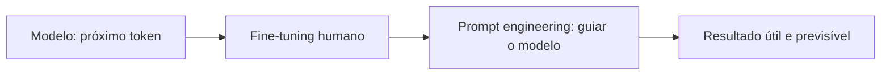
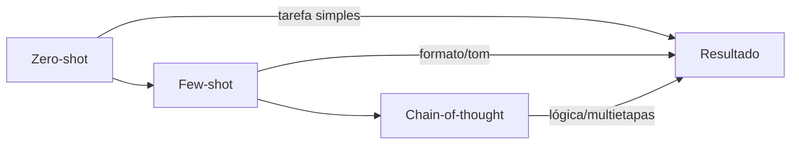
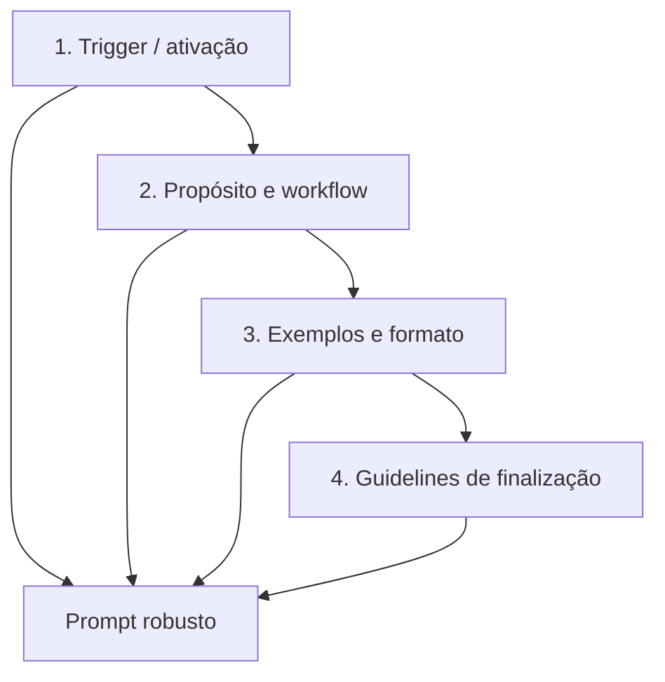
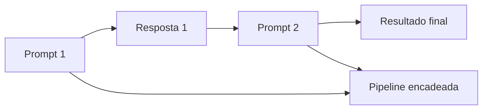
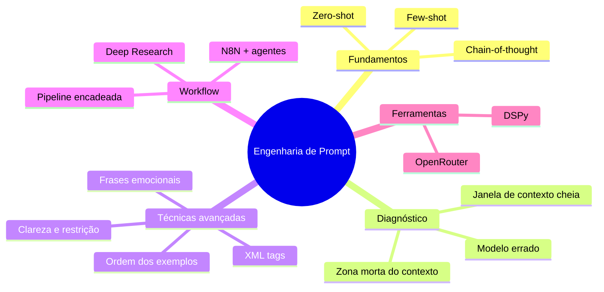

# 🔑 O Guia Definitivo de ENGENHARIA DE PROMPT (Como Dominar a IA)

> [!abstract] TL;DR
> Prompt engineering não é “saber conversar com a IA”. É **saber como o modelo funciona** para diagnosticar falhas, aplicar técnicas avançadas e construir fluxos de prompts encadeados.
>
> Três objetivos do guia:
> 1. Diagnosticar por que um prompt falha e corrigir.
> 2. Usar técnicas avançadas que a maioria dos guides não cobre.
> 3. Montar uma pipeline de prompts encadeados.

> [!info] Fonte
> **Título:** O Guia Definitivo de ENGENHARIA DE PROMPT (Como Dominar a IA)
> **Canal:** Gustavo Schineider
> **Duração:** 16:25
> **Data:** 2026-05-03
> **URL:** https://www.youtube.com/watch?v=xJzLJMRxFIc

---

## 🧠 Por que prompt engineering existe

> [!tip] Mentalidade correta
> LLMs são **máquinas de previsão do próximo token**. Fine-tuning com feedback humano adapta a resposta para ser útil, mas não elimina a necessidade de guiar o modelo.
>
> Prompt engineering não é usar "linguagem mágica" ou "comandos secretos". É **saber como o modelo processa o contexto** para obter o resultado que você quer.

---

## ⚙️ Técnicas fundamentais

### Zero-shot
- Sem exemplos. Apenas instrução + contexto.
- Melhor para **tarefas simples e bem definidas**, com respostas claras.
- Ex.: "Classifique o sentimento desta frase: 'Bateria morreu em duas horas'."

### Few-shot
- Com exemplos (mais de um).
- Ideal quando precisa de **formato ou tom consistente**.
- Vantagem sobre one-shot: o modelo fixeda melhor o padrão quando vê múltiplos exemplos.

### Chain-of-thought (CoT)
- Pedir explicitamente para o modelo **pensar passo a passo**.
- Melhor para **matemática, lógica e tarefas de múltiplas etapas**.
- Alguns modelos já ativam CoT nativamente quando a tarefa é difícil.

---

## 🚫 Falhas comuns e como evitar

> [!warning] Zona morta do contexto
> Em prompts grandes, o **meio do contexto é uma zona morta**. O modelo não recupera informações dali com consistência.
>
> Regra: informações importantes → **início ou final** do prompt.

### Estrutura ideal de prompt / skill

### Não-discuta com o modelo
- Se a resposta está errada, **não peça explicação**.
- Peça para ele **buscar mais informações** ou resetar o contexto.

### Não-faça vs. Faça
- Framings positivos são mais fortes.
- Ruim: "Não escreva uma resposta longa."
- Bom: "Escreva uma resposta com menos de 100 palavras."

> [!example] Por que o positivo funciona melhor
> Se o modelo quebrar o contexto, ele pode ler só a parte proibida e cumprir o inverso. O framing positivo restringe a ação diretamente.

---

## 🔥 Técnicas avançadas (pouco conhecidas)

### 1. XML tags para separação de blocos
- Estudo da Anthropic (2024): **+15 a +20% de performance**.
- Usar tags XML para delinear tarefa, entrada e exemplo.
- Markdown também funciona, mas com ganho menor.

### 2. Ordem dos exemplos importa
- O último exemplo tem **influência desproporcional**.
- Coloque no final o exemplo **mais próximo do caso atual** ou o mais completo.

### 3. Frases emocionais / stakes
- Frases como "isso é importante para minha carreira" podem dar um boost.
- Útil para tarefas pontuais, não para sistemas de produção.

### 4. Clareza reduce ambiguidade
- Perguntar “em que ano a torre foi construída?” abre múltiplos anos possíveis.
- Perguntar “quando foi concluída a construção da Torre Eiffel?” restringe a uma resposta.
- **Reduzir o espaço de respostas possíveis** é sempre bom.

---

## 🏗️ Prompt engineering como habilidade base

> [!success] Insight central
> Você vai pedir para uma IA criar prompts na maior parte do tempo. Mas quando o sistema falhar, **você precisa saber corrigir** — como um programador que sabe debugar mesmo usando IA.

### Otimizadores automáticos
- Ferramentas como **DSPy** existem.
- Pedir para a IA gerar prompts usando referências de prompt engineering costuma ser mais eficiente que escrever manualmente.

### Modelo forte vs. modelo pequeno
| Cenário | Estratégia |
|---|---|
| Modelo forte (Claude Opus, GPT-5.5) | Prompt simples muitas vezes basta |
| Modelo pequeno (7B local) | Prompt detalhado e explícito quase sempre necessário |

> [!info] Analogia com humanos
> Pedir "faça o app" para um dev sênior = pedir a mesma coisa para um estagiário. O primeiro entrega com menos instrução; o segundo precisa do passo a passo.

---

## ❌ O que prompt engineering não resolve

| Problema | Solução real |
|---|---|
| Modelo errado para a tarefa | Trocá-lo ou fazer fine-tuning |
| Contexto muito grande para o modelo | Usar modelo com janela maior ou RAG / agent |
| Alucinação em dados privados | Injetar o contexto necessário no prompt |
| Falta de informação que o modelo não tem | Fornecer dados ou usar tools/retrieval |

> [!warning] Quando prompt não é a resposta
> Se o modelo não tem acesso a youtube, ele vai alucinar ou dizer que não tem acesso. **Incluir instruções de contexto** (ex.: "use Playwright e acesse minha conta") resolve isso.

---

## 🛠️ Ferramentas e workflow

- **Chain de prompts:** saída de um modelo → input do próximo (ex.: geração de imagens, cópia, N8N com agentes).
- **Deep Research Preview (AI Studio):** workflow de pesquisa com modelo 3.1 Pro preview.
  - Usar para gerar um prompt de pesquisador → rodar no Deep Researcher.
- **OpenRouter:** comparar vários modelos ao mesmo tempo (qualidade + budget).

---

## 🗺️ Mapa do conhecimento

---

## 📌 Cola rápida

| Problema | Técnica |
|---|---|
| Modelo dá respostas genéricas | Seja específico + reduza ambiguidade |
| Formato inconsistente | Few-shot com múltiplos exemplos |
| Tarefa de lógica/matemática | Chain-of-thought |
| Prompt grande com pontos críticos | Mova pontos-chave para o início/final |
| Modelo invented dados que não tem | Injete o contexto / use RAG |
| Modelo quebra facilmente | Use framing positivo, não negativo |
| Boost rápido em tarefa pontual | Adicione stake emocional + exemplo perfeito no final |

---

> [!quote] Gustavo Schineider
> "Você vai aprender a criar prompts em 10 minutos melhor do que um cara fez em 20 horas. Mas quando o sistema falhar, você precisa saber o que está acontecendo por trás."
