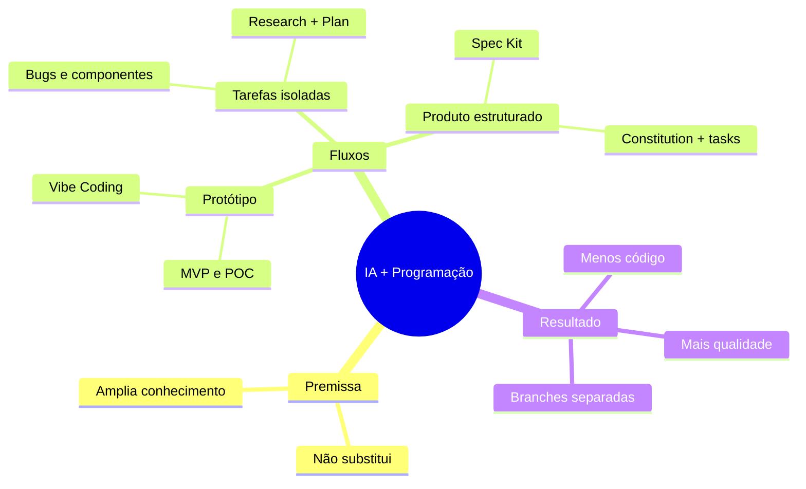

# O jeito certo de usar IA para programar

> [!abstract] TL;DR
> IA já é requisito em 2026. A qualidade do resultado depende do seu contexto, não da ferramenta. O vídeo mostra três fluxos de uso: para prototipagem, para tarefas diárias e para produtos estruturados.

> [!info] Fonte
> **Canal:** Sujeito programador
> **Vídeo:** O jeito certo de usar IA para programar (ninguém te explica isso)
> **URL:** https://www.youtube.com/watch?v=UOKCuEzeOAo
> **Data:** 2026-06-18

---

IA funciona como amplificador: se você sabe o que quer, ganha velocidade. Se não tem base, a resposta fica à altura do seu contexto.

Três fluxos de uso real:

- **Vibe Coding** — aceitar tudo que a IA gera e entrar no loop de copiar/colar. Serve só para POC/MVP rápido. Para estudo, é armadilha.
- **Desenvolvimento agêntico** — para tarefas simples/médias (bug pequeno, refatoração, componente isolado). Funciona melhor quando você aplica uma sequência curta: entenda o código atual, defina o que precisa, depois execute.
- **Spec Kit** — para recursos complexos ou produto final. Define regras do projeto primeiro, depois gera a sequência de implementação, sempre em branch separada.

Ponto direto: com disciplina, você escreve menos código e entrega mais qualidade. O que muda não é só a ferramenta, é o modo de trabalhar.

---

Citações:

> "A IA é proporcional ao seu conhecimento." — Sujeito programador

> "Vibe Coding… é uma armadilha gigantesca." — Sujeito programador

> "Ser programador em 2026 pra frente mudou completamente a forma que você trabalha." — Sujeito programador

